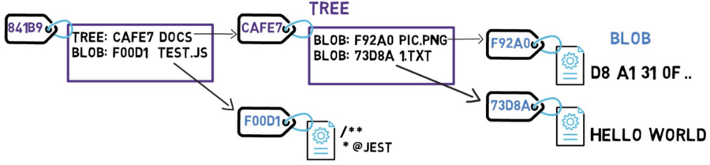

# DIO EDUZZ fullstack dev

Aqui são feitas as anotações relacionadas ao bootcamp FullStack Dev Eduzz

# Projetos Ágeis com SCRUM

## Introdução

### Introdução a Gestão de Projetos e ao SCRUM

Dos objetivos de negócio surgem os requisitos. 

A maior parte das funcionalidades inseridas no software não são utilizadas pelo usuário final. (segue o princípio de Pareto).

No gerenciamento de projetos tradicional, cada etapa é realizada de uma vez. O processo é sequencial. Só permite que o projeto avance quando uma fase está inteiramente completa.

No gerenciamento de projetos ágil, o software é construído por partes (incremental) e cada parte executada em um ciclo iterativo. Cada etapa tem um tempo máximo para finalização (1 mês, por exemplo). Assim, o escopo é adaptativo, definido ao longo do projeto. O projeto é controlado por funcionalidades entregues. Assim, pode-se obter opinião a cada etapa de desenvolvimento, ou seja, a cada versão lançada. Dessa forma mudanças são constantes atendendo as opiniões dos usuários. 

Com o SCRUM você verifica se estava errado em um prazo máximo de 30 dias.

O que é ser ágil?

- rapidez nas mudanças e desembaraço;
- Simplificar as tarefas. Fazer as atividades essenciais primeiramente.
- Maior valor para o cliente que utiliza o software em um menor intervalo de tempo.

O SCRUM é um dos frameworks de gerenciamento de projetos ágeis. Ele utiliza equipes pequenas e multidisciplinares para produzir melhores resultados.

Os pilares do SCRUM são transparência, adaptação e inspeção. Nesse sentido dá-se maior valor à comunicação do que à conversa. Demonstrar mais o software para receber mais feedbacks. Por fim, aprender com o uso do software. Assim, o usuário acaba se envolvendo em todo o ciclo de desenvolvimento.

Quanto aos times SCRUM, as equipes se auto-organizam, com as tarefas sendo do time e todos sendo responsáveis. Assim, busca-se um maior comprometimento da equipe com os resultados esperados.

As statups usualmente utilizam essa metodologia, pois assim conseguem seguir a filosofia Minimum Viable Product. Ou seja, conseguem oferecer ao produto um produto rapidamente que será expandido ao passo que o desenvolvimento atinge novas etapas.

### Papéis e Responsabilidades

- Product owner (PO);
- Scrum Master (SM);
- Time de desenvolvimento (DEV) - 3 a 9 pessoas.

O PO Representa a área de negócios, ele irá definir as funcionalidades do software (Backlog - The backlog is a list of everything from features, enhancements, bugs, and user requirements needed to build a complete product). Prioriza as funcionalidades de acordo com o valor do negócio. Deve garantir que o time dev entenda os itens do backlog.

O SM deve garantir o uso correto do Scrum, mas não é um gerente de projeto, agindo como um facilitador. Ele deve auxiliar o PO no planejamento e estimativas do backlog. Ele treina o time em autogerenciamento e interdisciplinaridade. Tenta fazer com que o time se torne independente.

O time DEV deve possuir habilidades para desenvolver, testar, criar e desenhar, ou seja, tudo que for necessário para entregar o software.

### Cerimônias do Scrum

Time Box: Tempo máximo para fazer uma cerimônia ou sprint. Serve para doutrinar a equipa a utilizar um tempo máximo para fazer uma cerimônia (reunião).

Sprint: é o principal evento do Scrum, máximo de 30 dias. É composta pelo planejamento da Sprint, Reuniões diárias, revisão e retrospectiva. O planejamento é feito no primeiro dia da Sprint com duração de até 8 horas, definido o que fazer e como fazer (o time dev define as atividades para realizar as atividades definidas). Nas reuniões diárias, o time dev deve informar o que fez no dia anterior, o que fará no dia e se existe algum impedimento, essa reunião é rápida (time-box de 15 min, feita em pé para ser rápida). O time dev também utiliza um quadro KAMBAN para monitorar o andamento. A revisão da Sprint é feito ao final da Sprint, onde o time dev apresenta para o PO o trabalho feito (duração 4 horas). A retrospectiva da Sprint também ocorre no último dia (time box de 3 horas ou menos), onde basicamente participam o time dev, onde cada membro deve ser transparente apresentando os erros/problemas que a equipe teve com o intuito de sumarizar as lições aprendidas (Transparência). 

## Fundamentos de um Projeto Ágil

### Papéis e Responsabilidades

O SM tem o papel de disseminar a cultura Scrum, incentivando o trabalho independente e auto-gerenciável, até o ponto de que o SM não fosse mais necessário.

[Refining and PLanning](https://www.youtube.com/watch?v=McqsJrS3-Rs) 

O PO apresenta os requisitos. Desses os mais relevantes são selecionados. Na sequência, cada requisito selecionado é destrinchado em "histórias" (descrições das tarefas necessárias para implementar o requisito). Tendo os principais requisitos selecionados e suas histórias descritas, um dos requisitos é selecionado como principal, ou seja, o mais importante e precisa necessariamente ser finalizado ao final da Sprint.

Release PLanning: lançamento de software. Pode, mas não é obrigatório, ser executado ao final de cada Sprint. QUanto maior o número de sprints antes de fazer a release, maior a chance de ocorrerem problemas. 

Release Planing de multiples Squads: Vários times fazendo várias coisas distintas que podem ou não estar conectadas, mas que precisam ser lançadas como uma única release. 

Release Planning de Projeto: O PO precisa quebrar a demanda ao máximo, simplificando as histórias de modo a facilitar o desenvolvimento. 

### Analisando Escope e Prioridade

O Product Backlog é composto por épicos (incremento sem muito detalhamento, ajuda a te direcionar e dos caminhos que deve seguir. As histórias fazem o detalhamento dos épicos, assim, um épico normalmente se divide em várias histórias, onde ficam descritos o que deve acontecer e suas regras de negócio. 

Gestão de riscos Positivos: os riscos positivos sã muito ignorados nos projetos, porém um dos fatores de maiores ganhos no desenvolvimento de sistemas.

A gestão de riscos negativos: esses itens podem afetar o prazo, o custo, ou o escopo de um projeto de maneira que possa acarretar na inviabilização do projeto. 

Qual método é mais indicado para definir o Escopo do Projeto? Entender qual o ganho antes de definir o escopo.

O que compõe um produc backlog? Épico e histórias.

Qual a importância de se mapear riscos positivos? Pode priorizar outros itens no backlog.

## Conceitos e atividades essenciais

### Conceitos e planejamento de tarefas

Diferença entre história, épico e tarefa: Imaginando a tarefa de construir uma bicicleta, assim, o projeto bicicleta é um conjunto de épicos relacionados as peças da bicicleta (aro, quadro, celim, ...). O épico é o objetivo macro a ser atingido, esse precisa ser quebrado em objetivos menores. Assim, o épico garvo é subdividido nos subobjetivos guidão, amortecedor e na peça interna ao garfo que também se chama garfo. O guidão é uma história do épico garfo. As tarefas são ações/atividades que pretende ter como resultado as histórias e por fim o épico. Assim, uma história é um conjunto de tarefas, e um épico um conjunto de histórias.

A história deve ser descrita a nível de negócio, de modo que o time dev entenda o que deve ser feito e para que e como será usada, com o intuito de melhorar a qualidade do resultado final.   

Qual característica melhor descreve uma história? Uma tarefa descrita ao nível de negócio.

O que é uma tarefa? Um conjunto de atividades que o time de desenvolvimento deve desempenhar para entregar a história. 

Critério de aceite: é uma lista de critérios que deve ser atingidos de modo que a história seja entregue. Assim, os critérios de aceite tem o objetivo de clarear os objetivos a serem alcançados para solucionar um dado problema.

Planning Poker: Após determinar as histórias e as tarefas, cada membro do time vota para determinar a complexidade da tarefa, de modo a determinar os recursos e o tempo necessário de desenvolvimento. Quando as tarefas recebem uma pontuação elevada, a tarefa deve ser dividida e simplificada. Para cada tarefa, os membros que apresentaram a maior e menor pontuação para a tarefa em questão deve explicar a suas motivações. Outra opção ao planning poker existe o sistema de tamanho de camisa.

Planejamento. O planejamento é dividido em duas etapas. Na primeira o PO apresenta e discute os requisitos, as histórias. Na segunda o time dev cria as tarefas e as estima para cada história. Nessa etapa é normal que o PO não seja incluído. Na segunda etapa pode ainda ocorrer das histórias serem quebradas e/ou algumas serem excluídas, dependendo das estimativas dadas para as tarefas atreladas as histórias mais importantes. Com as histórias e atividades definidas o PO define a história mais importante, a essencial para a finalização do Sprint.

O que é um critério de aceite? É uma lista de critérios para que a história atenda os requisitos do cliente.

O que é planning poker? Uma atividade de mensuração do esforço e complexidade das tarefas ou histórias. 

### Ritos

Daily: Ocorre diariamente com duração de até 15 min. Serve para cada membro saber o que os outros membros do time dev estão fazendo. São cobradas três perguntas principais: 1) o que fiz ontem; 2) o que fazer hoje; 3) existe algum impeditivo. Outros questionamentos podem ser feitos desde que contribuam com o desenvolvimento do projeto.

Retrospectiva: são discutidos os pontos bons e ruins da sprint e como a próxima pode ser aprimoradas. Assim os pontos positivos são maximizados e os ruins minimizados;

Quem tem participação obrigatória na daily? O time dev apenas.

Quem tem participação obrigatória na Retro? O time dev e o SM. O PO é optativo.

Refinamento: é um rito não obrigatório. tem a finalidade de aumentar o entendimento da demanda pelo time dev. Assim, nessa parte o time faz perguntas ao PO sobre as histórias a serem executadas. Todo o time deve estar presente para entender a demanda.

Review: o time dev apresenta o que foi desenvolvido na última sprint. Todos os interessados na entrega são convidados. Assim, todos podem ver o que está sendo entregue e averiguar o processo de desenvolvimento e se o resultado é válido para os objetivos do takeholder/cliente, ou seja, se agrega valor.

Em que momento acontece o Refinamento? O refinamento acontece antes do Planning, mas depois da sprint anterior. 

Qual é o principal objetivo da Review? Verificar se a demanda agrega valor ao negócio.

Maturidade do time: 

# Introdução ao Git e GitHub

## Navegação via command line interface e instalação

### Comandos básicos para o terminal

O git é um CLI (command line interface), ao contrário das tradicionais GUI (graphic user interface).

Commandos:

- cd - change directory
    - cd .. retorna para a pasta "superior"
- ls - list directories
- mkdir - cria diretório
- clear (ctrl l) - clear the terminal
- echo - coloca no terminal o texto escrito na sequência
    - echo hello > hello.txt : escreve hello e coloca esse texto no arquivo hello.txt
- rm  - remove
    - rm -rf: remove -r recursive, select all files and folders inside of the directory -f force, does not ask for permissions. Remove the directory and all its content.

Os comandos possuem flags complementares, que alteram como o comando atua.

## Como o Git funciona

### Tópicos fundamentais, Objetos internos

Sha1 - algoritmo de encriptação. A cada alteração uma nova chave de 40 caracteres é criado como chave. 

[A Visual Guide to Git Internals — Objects, Branches, and How to Create a Repo From Scratch](https://www.freecodecamp.org/news/git-internals-objects-branches-create-repo/)

In `git`, the contents of files are stored in objects called **blobs**, binary large objects. The difference between **blobs** and files is that files also contain meta-data. Every blob in git is identified by its SHA-1 hash.

In `git`, the equivalent of a directory is a **tree**. A **tree** is basically a directory listing, referring to **blobs** as well as other **trees**. **Trees** are identified by their SHA-1 hashes as well. Referring to these objects, either **blobs** or other **trees**, happens via the SHA-1 hash of the objects.

The diagram above is equivalent to a file system with a root directory that has one file at /test.js, and a directory named /docs with two files: /docs/pic.png and /docs/1.txt.

Now it’s time to take a snapshot of that file system — and store all the files that existed at that time, along with their contents. In `git`, a snapshot is a **commit**. A **commit** object includes a pointer to the main **tree** (the root directory), as well as other meta-data such as the **committer**, a **commit** message and the **commit** time. In most cases, a **commit** also has one or more parent **commits** — the previous snapshot(s). Every commit holds the entire snapshot, not just diffs from the previous commit(s).

we changed the content from HELLO WORLD, to HELLO WORLD! It causes cascade change on the tree and commit (indicated in red). 

as long as an object doesn’t change, we don’t store it again. In this case, we don’t need to store blob F92A0 and blob F00D1 once more. We only refer to them by their hash values. We can then create our commit object.

- **blob —** contents of a file.
- **tree** — a directory listing (of **blobs** and **trees**).
- **commit** — a snapshot of the working tree.

### Chave SSH

Chave SSH é uma identificação da máquina para que o github identifique quem está realizando push and pull sem a necessidade de realizar outro tipo de identificação. 

SSH keys are created and used in pairs. The two keys are linked and cryptographically secure. One is your public key, and the other is your private key. They are tied to your user account. If multiple users on a single computer use SSH keys, they will each receive their own pair of 
keys. Your private key is installed in your home folder (usually), and the public key is installed on the remote computer—or computers—that you will need to access.

[create and install SSH keys](https://www.howtogeek.com/424510/how-to-create-and-install-ssh-keys-from-the-linux-shell/)

## Primeiros comandos Git

- git init - inicializa o git em um dado repositório

para ver os arquivos relacionados ao git é necessário utilizar a flag -a junto com ls (ls -a).

- git config —global user.name defines the user name
- git config —global user.email defines the user email
- git add * - seleciona todos os arquivos com alterações
- git commit -m 'message' - realiza commit e associa uma mensagem
- git status - verifica o status dos arquivos presentes no diretório.
- git clone - clona um repositória para a máquina
- git push - empura os commits locais para o repositório online
- git pull - puxa a última versão do repositório online para a nossa máquina

## Ciclo dos arquivos Git

Tipos de arquivos:

- Unmodified: arquivo no repositório git sem alterações, recém-criado ou que acabou de receber commit.
- Modified: arquivo com modificações
- Staged: arquivo que foi added, esses arquivos que sofrem o commit (sofrem um snapshot pelo objeto commit).

As alterações feitas nos arquivos na máquina não são refletidos automaticamente nos arquivos do servidor. Quando o commit é feito, os arquivos passam a integrar o repositório local e podem ser empurrados (push) para o repositório remoto.

## Resolvendo conflitos

Conflitos ocorrem quando duas pessoas fazem modificações ao mesmo tempo em uma mesma linha de código.

Quando uma pessoa empura (push) o codigo com alterações para o GitHub com alterações e na sequência outra pessoa também tenta empurar o mesmo código, o GitHub irá bloquear, informando que o código da segunda está desatualizado (esse é um problema de merge). O GitHub, informa que a versão do repositório remoto contêm alterações que não estão presentes no repositório local. Para solucionar esse problema, é necessário que a segunda pessoa puxe (git pull) o código do GitHub e faça uma comparação manual das linhas de conflito, definindo qual é a versão correta. Após essa conferência, é possível encaminhar as alterações para o GitHub com um push.

As alterações depois do pull serão sinalizados dentro de <<<< conflitos >>>>. O código dentro desse sinalizador precisa ser avaliado. Após avaliado, apenas o código final deve ser mantido, retirando o código desnecessário e os sinalizadores. 

Na sequência, utiliza-se o git add e o git commit normalmente. Finalizados os comits realiza-se o push final. Dessa forma identifica-se e resolve-se o conflito manualmente.
